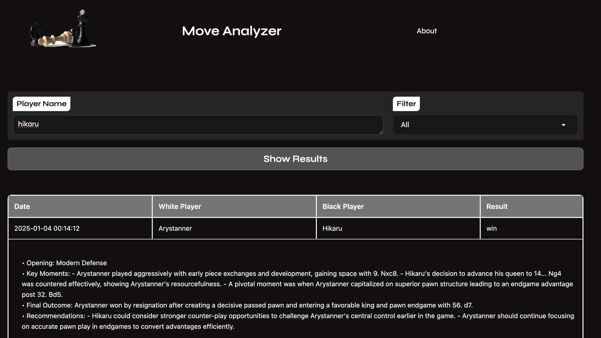

# Chess Game Analyzer

A web application that analyzes chess games from Chess.com using AI to provide insights and recommendations.

Chrome extension here: https://chromewebstore.google.com/detail/chess-game-analyzer/chanagjlgmiaidodekmfpahbgmbjafkh




## Features

- 🎮 Fetch and analyze chess games from Chess.com
- 🤖 Dual AI Analysis:
  - Google's Gemini 2.0 (default)
  - OpenAI's GPT-4 (optional)
- 📊 Filter games by:
  - Date ranges (Today, Last 7 days, Last 30 days)
  - Game results (wins, resignations, timeouts)


## Project Structure

```
chess-analyzer/
├── ai_model.py          # AI analysis using Gemini/GPT-4
├── interface.py         # Gradio web interface
├── main.py             # Chess.com API integration
├── chess.png           # Logo image
├── requirements.txt    # Python dependencies
├── tests/             # Test suite
│   ├── __init__.py
│   ├── test_ai_model.py
│   ├── test_chess_analyzer.py
│   ├── test_interface.py
│   └── run_tests.py
├── Dockerfile         # Container configuration
├── cloudbuild.yaml    # Google Cloud Build config
└── .env              # Environment variables (not tracked)
```

## Quick Start

1. **Clone and Install**
```bash
git clone <repository-url>
cd chess-analyzer
pip install -r requirements.txt
```

2. **Configure Environment**
```bash
# Create .env file with your API keys
echo "GOOGLE_API_KEY=your_gemini_key_here" > .env
echo "OPENAI_API_KEY=your_openai_key_here" >> .env  # Optional for GPT-4
```

3. **Run Locally**
```bash
python interface.py
```

## Development

### Running Tests
```bash
# Run all tests
python -m tests.run_tests

# Run specific test file
python -m unittest tests/test_chess_analyzer.py
```

### Docker Development
```bash
# Build image
docker build -t chess-analyzer .

# Run container
docker run -p 8080:8080 \
  -e GOOGLE_API_KEY=$GOOGLE_API_KEY \
  -e OPENAI_API_KEY=$OPENAI_API_KEY \
  chess-analyzer
```


## License

This project is licensed under the MIT License.

